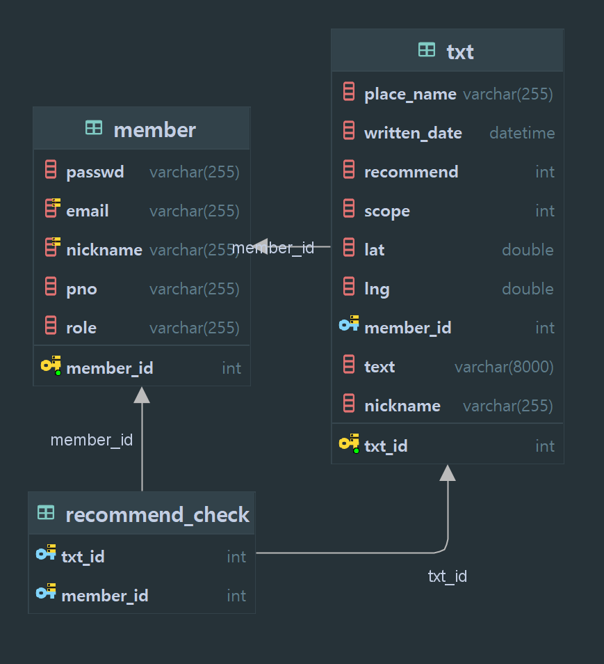

# Listaurant
ssginc 미니프로젝트2
## 개요
<맛집 게시판 공유 및 관리> 
자신의 위치 주변의 음식점 정보를 가져와서 위치를 확인하고 리뷰를 공유하는 웹페이지

## 개발환경
- IntelliJ
- mysql8
- java17
- git
- gradle
- jsp, bootstrap
- spring boot, spring web, mybatis, spring security, lombok, validation, java mail 

## 기능 요구사항
- 지도
  - 자신의 위치 정보를 기준으로 화면에 표시한다.
  - 주변 음식점 정보를 마커를 통해 표시한다.
  - 음직점 마커를 클릭시 게시글 화면으로 이동한다.
  - 맵이동시 원래 자신의 위치로 돌아오는 기능을 제공한다.
  - 검색 기능을 제공한다.
  - 첫 시작화면으로 제공한다.

- 게시글 기능
  - 음식점 위치를 표시하고 주변 정보를 제공한다.
  - 평균 별점, 리뷰를 제공한다.
  - 리뷰는 시간순,인기순 정렬이 가능해야 한다.
  - 리뷰 작성은 로그인된 사용자만 제공할 수 있다.
  - 로그인 되지 않은 사용자가 리뷰 작성시 로그인 화면으로 이동한다.
  - 자신이 작성한 댓글을 수정 삭제할 수 있다.
- 회원가입
  - 이메일,비밀번호,비밀번호확인,닉네임,휴대번호 값을 입력받아야 한다.
  - 이메일, 닉네임 중복을 확인한다.
  - 비밀번호와 비밀번호 확인 기능을 제공한다.
  - 비밀번호는 특수문자를 포함한 8자리 이상으로 한다.
  - 비밀번호는 암호화 해야한다.
- 로그인
  - 아이디와 비밀번호가 일치하지 않는다면 해당 알림을 보여준다.
  - 비밀번호를 잊은 사용자를 위해 이메일을 통한 임시 비밀번호를 발급한다.
- 마이페이지
  - 자신의 회원정보와 작성한 댓글 정보를 제공한다.
  - 자신의 닉네임,휴대전화번호,비밀번호를 수정할 수 있다.
  - 회원탈퇴를 제공한다.

### ERD

    
### 화면 설계
[화면설계](https://www.figma.com/design/4cTw0L2CaSl54goaPZvHE3/Untitled?node-id=0-1&t=FImaj8QB3C2yLU4c-1)
